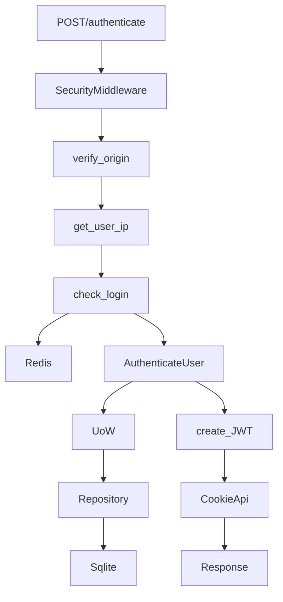

```mermaid
graph TD 
POST/authenticate --> SecurityMiddleware
SecurityMiddleware --> verify_origin
verify_origin --> get_user_ip
get_user_ip --> check_login --> Redis
check_login --> AuthenticateUser --> UoW --> Repository
Repository --> Sqlite
AuthenticateUser --> create_JWT --> CookieApi --> Response
```
